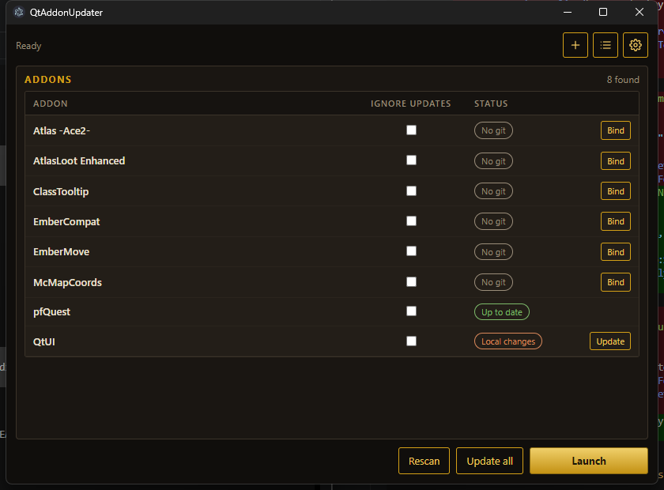

# QtAU — Qt AddonUpdater

A small Windows tool that updates World of Warcraft addons from git, then starts whatever launcher or client you point it at.

It works with any client that uses a normal `Interface/AddOns` folder: Vanilla, private servers, custom clients, and similar.



## Download

The compiled Windows build is on the [Releases](https://github.com/JercyJustice/QtAU/releases) page.

Download `QtAU.exe` and run it. No installer.

## Usage

1. Open **Settings** (gear icon) and set:
   - **AddOns folder** — your `Interface/AddOns` directory
   - **Launcher / Client** — the `.exe` that should start afterwards (optional)
2. QtAU scans every addon folder.
3. Addons that are git repositories are updated. Addons without git are left untouched.
4. Click **Launch** to start the selected exe, or enable **Launch after update** in settings.

The **+** button clones or binds an addon from a git URL (GitHub, GitLab, Gitea, and similar).

Hover an addon row to see version, author, branch, and remote.

## Settings

- **Update on start** — refresh git addons when QtAU opens
- **Launch after update** — start the selected launcher/client when updates finish
- **Overwrite local changes** — force-update addons that have uncommitted edits

QtAU stays open after a launch, so you can always change settings.

## Build from source

Needs [Node.js](https://nodejs.org/) 18 or newer.

```powershell
npm install
npm start          # development
npm run dist       # writes dist/QtAU.exe
```

## License

MIT
